# Pokémon Azure Databricks dbt Pipeline

## Project Overview

This project is an end-to-end cloud data engineering pipeline built using **Azure Data Factory**, **Azure Data Lake Storage Gen2**, **Azure Databricks**, **dbt**, and **Databricks dashboards**.

The pipeline ingests Pokémon data from the PokéAPI, lands the raw JSON files in Azure Data Lake Storage, processes the data through a Databricks medallion architecture, applies analytics modelling using dbt, and visualises the final output in a Databricks dashboard.

The purpose of this project was to demonstrate practical data engineering skills using modern cloud tools.

---

## Tools Used

* **Azure Data Factory**: API ingestion and orchestration
* **Azure Data Lake Storage Gen2**: raw data landing zone
* **Azure Databricks**: Spark/PySpark processing and medallion architecture
* **Delta Tables**: Bronze, Silver and Gold table storage
* **dbt**: SQL modelling, testing and analytics transformation
* **Databricks SQL Dashboards**: final reporting and visualisation layer
* **GitHub**: version control and project documentation

---

## Architecture

```text
PokéAPI
   ↓
Azure Data Factory
   ↓
Azure Data Lake Storage Gen2
   ↓
Azure Databricks
   ↓
Bronze → Silver → Gold
   ↓
dbt Models
   ↓
Databricks SQL Dashboard
```

---

## Pipeline Flow

1. Azure Data Factory calls the PokéAPI.
2. Raw Pokémon JSON files are landed in Azure Data Lake Storage Gen2.
3. Azure Databricks reads the raw JSON files from ADLS.
4. A PySpark Databricks notebook builds the Databricks medallion tables:

   * Bronze
   * Silver
   * Gold
5. dbt builds analytics models on top of the Databricks output.
6. Databricks SQL dashboards visualise the final dbt gold model.
7. Azure Data Factory is used to orchestrate and schedule the process.

---

## Databricks Medallion Architecture

### Bronze Layer

The Bronze layer stores the structured raw Pokémon API data loaded from ADLS Gen2.

The main Bronze table created in Databricks is:

```text
default.bronze_pokemon_details
```

This layer keeps the raw API structure and includes useful metadata such as the ingestion timestamp and source file path.

### Silver Layer

The Silver layer cleans and standardises the Pokémon data.

The main Silver table created in Databricks is:

```text
default.silver_pokemon
```

This layer extracts useful fields from the nested JSON, including:

* Pokémon ID
* Pokémon name
* Primary type
* Secondary type
* Abilities
* HP
* Attack
* Defence
* Special attack
* Special defence
* Speed
* Height
* Weight
* Sprite URL

### Gold Layer

The Gold layer creates a dashboard-ready Pokémon dataset.

The main Gold table created in Databricks is:

```text
default.gold_pokemon_dashboard
```

This table contains the cleaned Pokémon records and calculated fields such as total base stat.

---

## dbt Analytics Layer

dbt was used on top of the Databricks engineering outputs to create analytics-ready models.

The dbt models created were:

| dbt Model                     | Purpose                                                      |
| ----------------------------- | ------------------------------------------------------------ |
| `bronze_pokemon`              | Reads the curated Databricks Pokémon data into the dbt layer |
| `silver_pokemon_type_stats`   | Aggregates Pokémon statistics by primary type                |
| `gold_pokemon_type_dashboard` | Final dashboard-ready dbt model used for visualisations      |

The dbt output tables were created in the Databricks schema:

```text
dbt_mo
```

---

## Dashboard Outputs

The final Databricks dashboard includes:

* Pokémon count by primary type
* Average total base stat by primary type
* Average attack by primary type
* Average speed by primary type
* Final gold Pokémon type dashboard table

---

# Project Screenshots

## 1. Azure Data Factory Pipeline Overview

This screenshot shows the Azure Data Factory pipeline used to orchestrate the Pokémon ingestion and downstream processing.

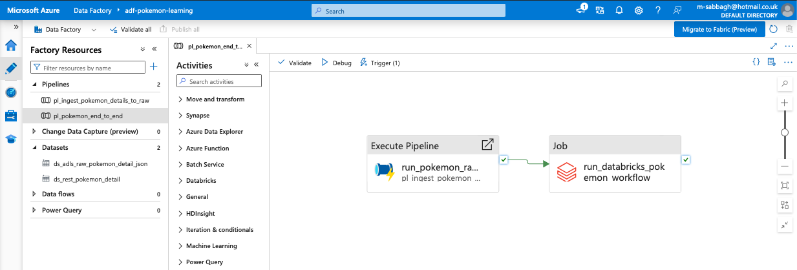

---

## 2. ADF Ingestion Pipeline

This screenshot shows the ingestion pipeline used to call the PokéAPI and copy Pokémon JSON data into Azure Data Lake Storage Gen2.

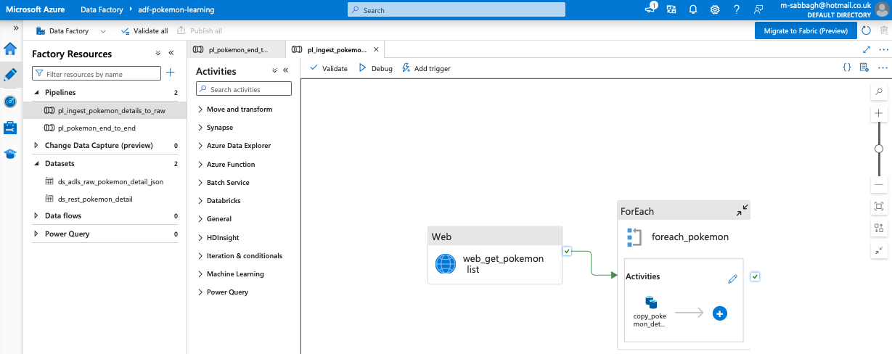

---

## 3. ADF Successful Pipeline Run

This screenshot shows a successful Azure Data Factory pipeline run.

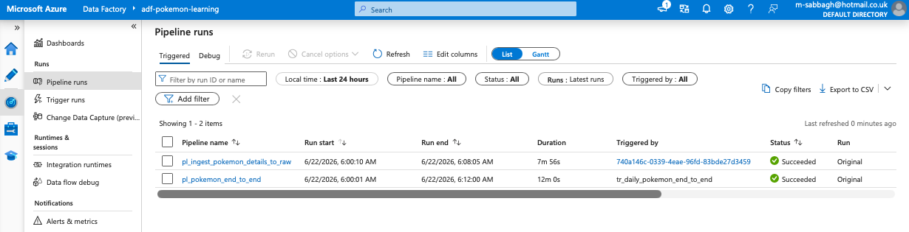

---

## 4. Raw Pokémon Files in ADLS Gen2

This screenshot shows the raw Pokémon JSON files landed in Azure Data Lake Storage Gen2.

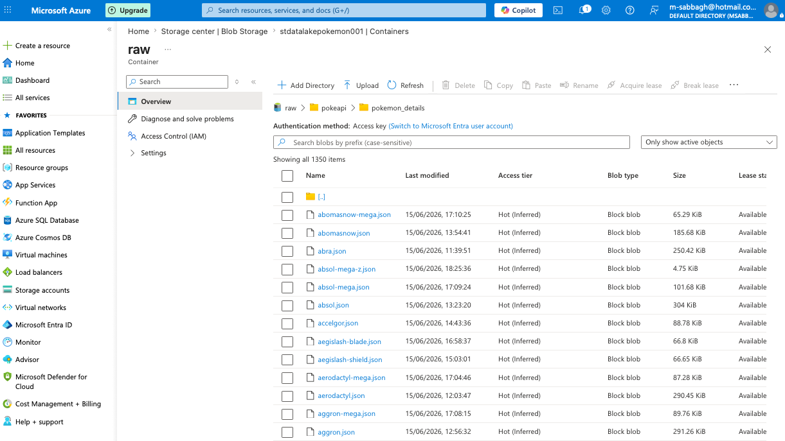

---

## 5. Databricks Notebook Folder

This screenshot shows the Databricks notebook used to build the Bronze, Silver and Gold medallion tables.

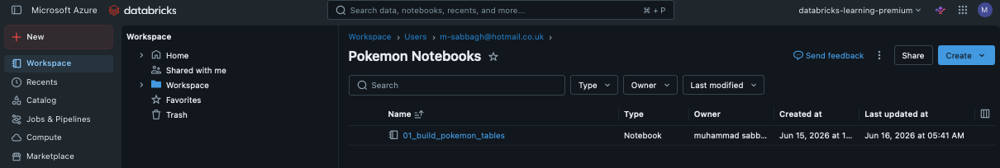

---

## 6. Databricks Bronze Processing

This screenshot shows the PySpark code reading raw JSON files from ADLS and creating the Bronze Delta table.

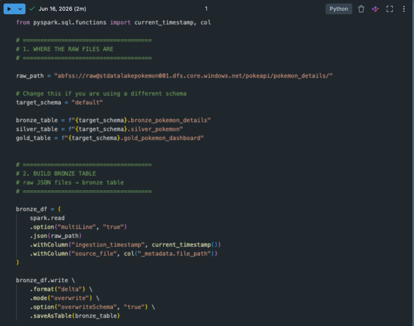

---

## 7. Databricks Silver and Gold Processing

This screenshot shows the transformation logic used to clean the Pokémon data and create the Silver and Gold tables.

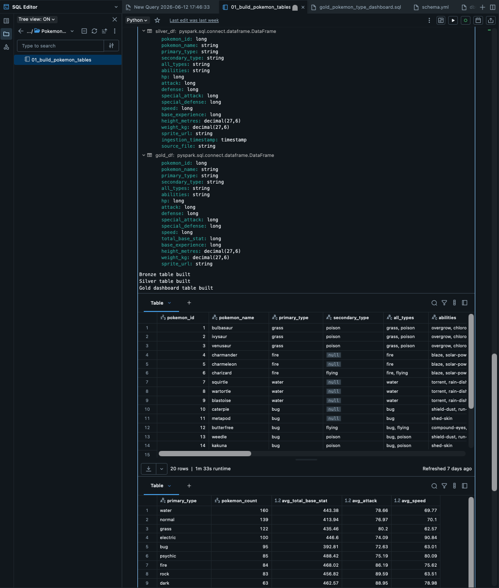

---

## 8. Final Gold Table Query Output

This screenshot shows the final gold table output used for analysis and dashboarding.

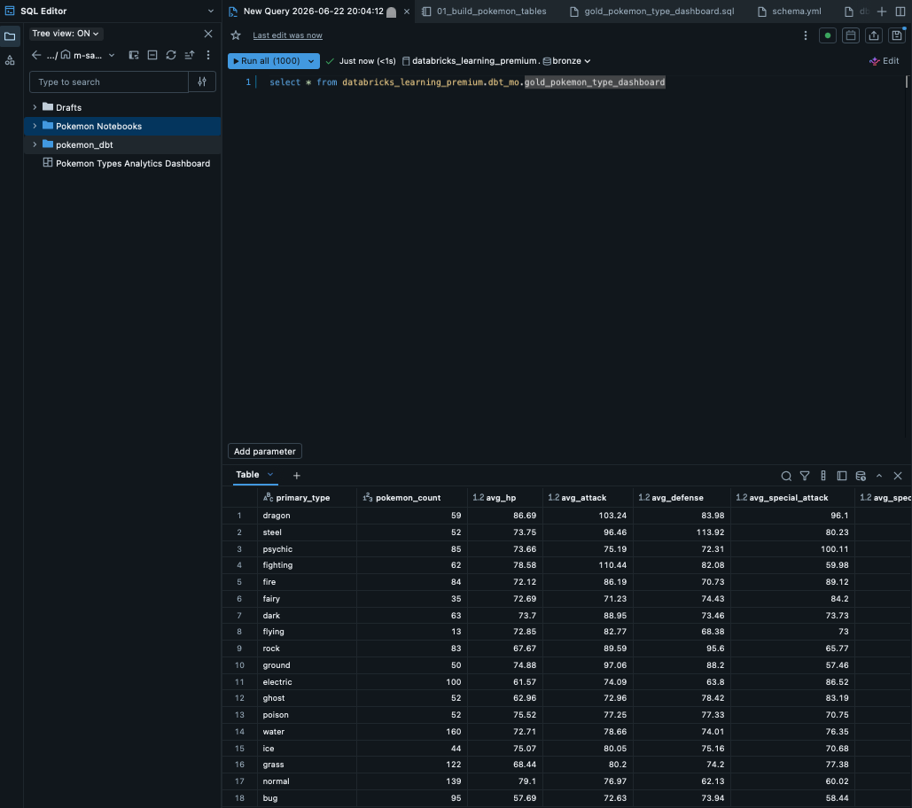

---

## 9. dbt Model Files

This screenshot shows the dbt model files used for the analytics layer.

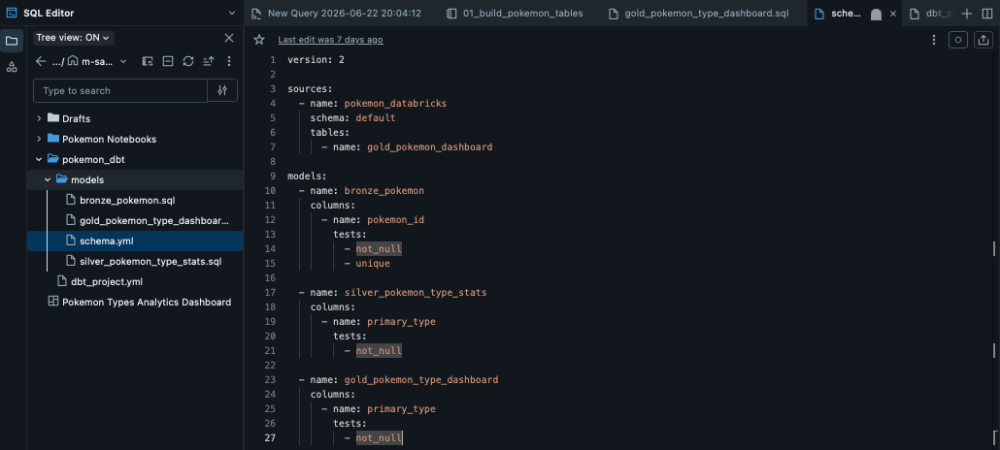

---

## 10. Run Pokémon dbt Models Job

This screenshot shows the job/pipeline step used to run the Pokémon dbt models.

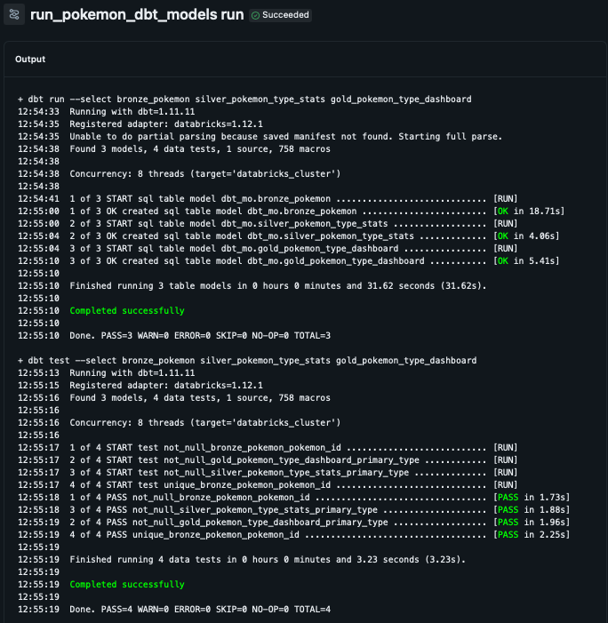

---

## 11. Databricks Dashboard

This screenshot shows the final Databricks dashboard built from the gold dbt model.

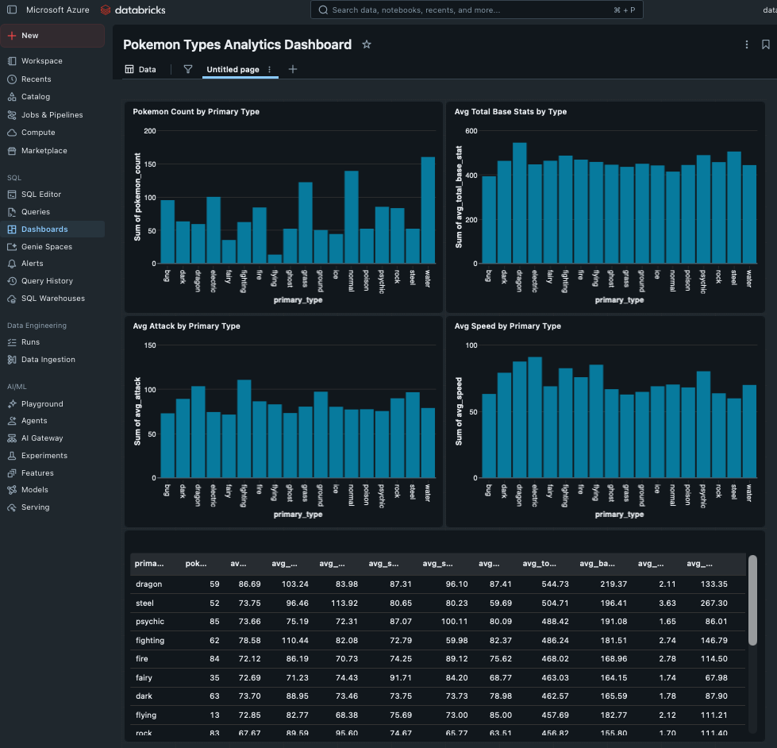

---

## 12. ADF Daily Trigger

This screenshot shows the scheduled Azure Data Factory trigger used to automate the pipeline.

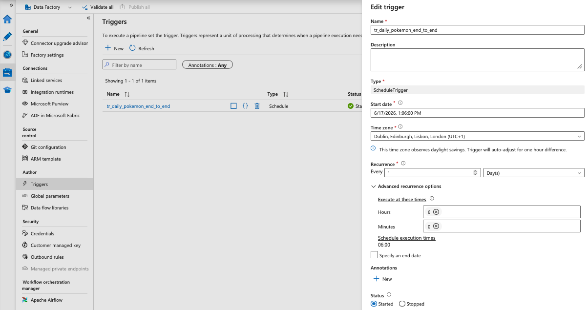

---

## Repository Structure

```text
pokemon-azure-databricks-dbt-pipeline/
│
├── README.md
├── .gitignore
│
├── docs/
│   ├── project_walkthrough.md
│   └── screenshots/
│       ├── 01_adf_pipeline_overview.png
│       ├── 02_adf_ingestion_pipeline.png
│       ├── 03_adf_successful_run.png
│       ├── 04_adls_raw_pokemon_files.png
│       ├── 05_databricks_notebook_folder.png
│       ├── 06_databricks_bronze_notebook.png
│       ├── 07_databricks_silver_gold_notebook.png
│       ├── 08_gold_table_query_result.png
│       ├── 09_dbt_model_files.png
│       ├── 10_run_pokemon_dbt_models_job.png
│       ├── 11_databricks_dashboard.png
│       └── 12_adf_daily_trigger.png
│
├── adf/
│   ├── pipeline_overview.md
│   └── pipeline_json/
│
├── databricks/
│   ├── notebooks/
│   │   └── 01_pokemon_medallion_pipeline.py
│   └── sql/
│       └── dashboard_queries.sql
│
├── dbt/
│   └── pokemon_dbt/
│       ├── dbt_project.yml
│       └── models/
│           ├── bronze_pokemon.sql
│           ├── silver_pokemon_type_stats.sql
│           ├── gold_pokemon_type_dashboard.sql
│           └── schema.yml
│
└── sample_data/
    └── pokemon_sample.json
```

---

## Key Skills Demonstrated

This project demonstrates experience with:

* API ingestion using Azure Data Factory
* Cloud data lake storage using ADLS Gen2
* Spark and PySpark transformations in Azure Databricks
* Medallion architecture design
* Delta table creation
* dbt model development
* dbt testing and documentation
* SQL-based analytics modelling
* Databricks SQL dashboarding
* End-to-end cloud pipeline orchestration
* GitHub project documentation

---

## Notes

This project was built as a practical portfolio project to demonstrate Azure, Databricks, dbt and dashboarding skills.

The project uses Pokémon data from the PokéAPI as a public, non-sensitive dataset. The focus of the project is not the dataset itself, but the end-to-end data engineering process used to ingest, transform, model and visualise the data.
